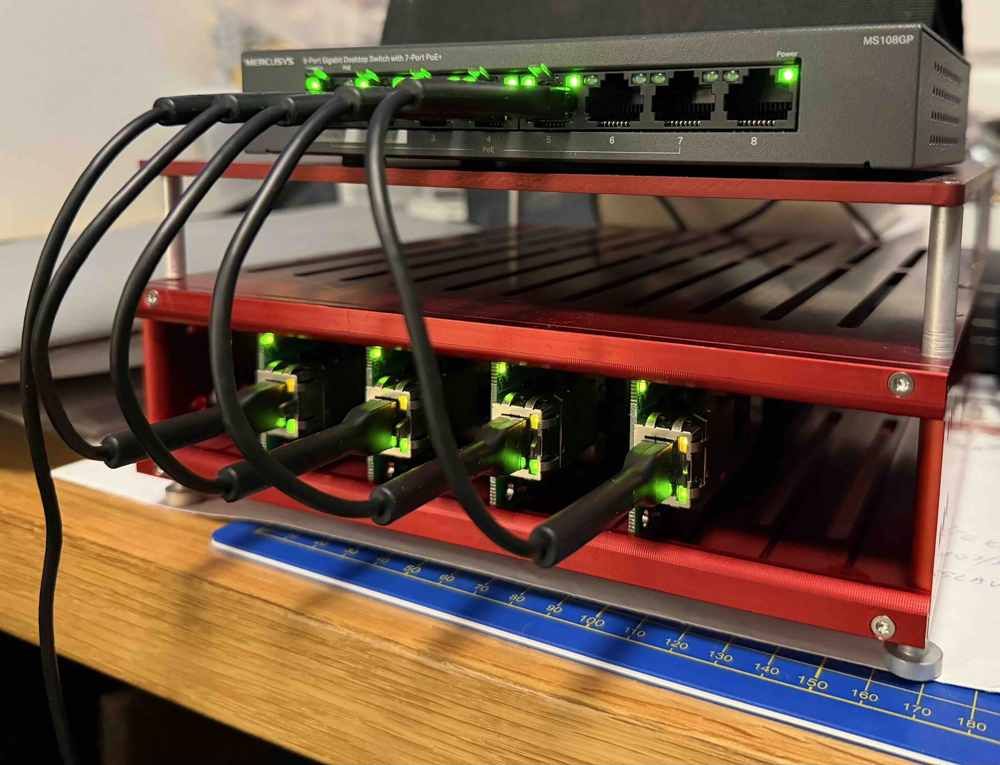

# Mixed-Architecture K3s Homelab

A 7-node K3s cluster spanning Raspberry Pi CM5s, x86 Proxmox VMs, and a bare-metal SFF PC — fully automated with Ansible, designed to be destroyed and rebuilt from scratch in minutes.



## Topology

| Node | Role | Hardware | OS |
|------|------|----------|----|
| `rpi-k3s-1` | Server (control plane, etcd) | Raspberry Pi CM5, 16 GB RAM | Ubuntu 24.04 LTS |
| `rpi-k3s-2` | Server (control plane, etcd) | Raspberry Pi CM5, 16 GB RAM | Ubuntu 24.04 LTS |
| `rpi-k3s-3` | Server (control plane, etcd) | Raspberry Pi CM5, 16 GB RAM | Ubuntu 24.04 LTS |
| `rpi-k3s-4` | Agent | Raspberry Pi CM5, 16 GB RAM | Ubuntu 24.04 LTS |
| `k3s-x86-1` | Agent | Proxmox VM, 4 vCPU, 16 GB | Ubuntu 24.04 LTS |
| `k3s-x86-2` | Agent | Proxmox VM, 4 vCPU, 16 GB | Ubuntu 24.04 LTS |
| `minisforum-c` | Agent | Minisforum SFF, 62 GB RAM | CachyOS (Arch family) |

- **HA control plane:** 3 servers running embedded etcd, fronted by a `kube-vip` ARP VIP
- **Two-site network:** Pi cluster at the home site, x86 VMs at a remote site, bridged over a site-to-site VPN
- **Tailscale overlay** on every cluster node + jump hosts (subnet routes, MagicDNS, in-tailscaled SSH)

## Stack

### Cluster core
| Layer | Tool | Notes |
|-------|------|-------|
| Distribution | K3s | Single-binary K8s, embedded etcd HA |
| Container runtime | containerd | Bundled with K3s |
| CNI | Flannel | Bundled; VXLAN across sites |
| Ingress | Traefik | Bundled; cluster-wide HTTP→HTTPS redirect via `HelmChartConfig` |
| LoadBalancer | MetalLB | L2/ARP mode on the home VLAN |
| Control-plane VIP | kube-vip | ARP VIP shared by the 3 servers |
| Storage (default) | Longhorn | 2 replicas, `longhorn-storage` SC pins big PVCs to x86/SFF |
| Storage tier (pinned) | `longhorn-storage` SC | x86/SFF nodes tagged `storage`; keeps replicas off Pi eMMC |
| Internal TLS | cert-manager + self-signed CA | 10-year ECDSA root, per-host leaf certs minted by ingress-shim |

### GitOps + supply chain
| Layer | Tool | Notes |
|-------|------|-------|
| Self-hosted git | Gitea + Forgejo | Both run side-by-side; Forgejo for personal repos, Gitea for the container registry + DR mirror sources |
| Container registry | Gitea registry + ghcr.io | Mixed (in-cluster + public) |
| GitOps controller | ArgoCD | CRD-based applications |
| Image promotion | Argo CD Image Updater v1.1 | CRD-based, digest strategy, 2-min poll |
| Renovate (chart/version tracking) | Mend Cloud | Custom regex managers for K3s, kube-vip, alertmanager-ntfy, Wazuh |

### Identity, secrets, certs
| Layer | Tool | Notes |
|-------|------|-------|
| SSO / IdP | Authentik | OIDC; wave 1 wired for Grafana + ArgoCD |
| Password vault | Vaultwarden | LAN-only HTTPS via internal CA |
| Cluster secrets | Ansible Vault | Encrypted `vault.yml` next to inventory |
| Cert chain | `selfsigned-bootstrap` → internal CA root → cluster issuer | All `*.<local-domain>` ingresses on `websecure` |

### Observability + security
| Layer | Tool | Notes |
|-------|------|-------|
| Metrics | Prometheus | 20 d retention, x86-pinned PVC |
| Dashboards | Grafana | OIDC via Authentik + native admin break-glass |
| Alerts → mobile | Alertmanager → `alertmanager-ntfy` bridge → self-hosted ntfy | Push notifications to phone |
| Logs (cluster pods + journald) | Grafana Alloy DS | Successor to Promtail; ships to Loki |
| Logs (Pi-hole) | Promtail (Docker) | Tails `pihole.log` on the DNS box → Loki via NodePort |
| Log store | Loki (single-binary) | x86-pinned, structured metadata for high-cardinality fields |
| Disk SMART | `prometheus-smartctl-exporter` | DaemonSet on x86 nodes only (Pi eMMC has no useful SMART) |
| K8s vulnerability scanning | Trivy Operator | ClientServer mode; reports as `VulnerabilityReport` CRDs |
| Host IDS / agent | Wazuh | Manager on a standalone VM; agents on every cluster + SFF node |
| Web UI | Headlamp | Kubernetes dashboard (successor to the retired upstream one) |

### External access + backup
| Layer | Tool | Notes |
|-------|------|-------|
| Public ingress | Cloudflare Tunnel | Zero-trust egress; no inbound NAT |
| Remote access | Tailscale | Subnet routes from the 3 K3s servers; MagicDNS clean names |
| Longhorn backups | S3-compatible (Cloudflare R2) | Daily, retain 30; critical PVCs labeled for `critical-backup` RecurringJob |
| etcd snapshots | K3s built-in + S3 push | 6 h cron, retain 12, offsite to R2 |

### Workloads (not exhaustive)
- **Pi-hole DNS** on a SFF box (Docker), with structured-metadata log shipping + ntfy notifications on alert rules
- **Open WebUI + Ollama** (GPU server runs Ollama in Docker; Open WebUI runs in cluster, talks to Ollama via headless service)
- **Headlamp** — Kubernetes web UI
- Various personal data-tracking apps deployed via Image Updater (prod + test environments)

## Quick start

```bash
# Flash a CM5 node from a base Ubuntu image (cloud-init seeded automatically)
make flash NODE=rpi-k3s-1 IMAGE=~/Downloads/ubuntu-server.img.xz

# Full cluster build from clean slate
make all

# Tear down + rebuild
make nuke && make all
```

Selected sub-commands (full list: `make help`):

```bash
make prepare          # Apply common role to every node (Debian + Arch dispatch)
make k3s              # Install K3s HA control plane + agents
make monitoring       # Prometheus + Grafana + Loki + Alloy + smartctl-exporter + alertmanager-ntfy
make longhorn         # Distributed storage with x86-pinned class
make backup           # Configure Longhorn → R2 + etcd snapshots
make gitea forgejo    # Self-hosted git stack
make argocd           # GitOps controller + Image Updater
make cert-manager     # Internal CA + cluster-wide HTTPS redirect
make authentik        # OIDC provider (manual wave-1 client provisioning)
make headlamp         # Kubernetes web UI
make upgrade-packages # Fleet-wide OS package upgrade with rolling reboots
```

## Operational references

- `ansible/` — playbooks (`00-` bootstrap, numbered in dependency order) and roles (`common`, `common-arch`, `k3s-server`, `k3s-agent`, `tailscale`, `ollama`, `pihole-monitor`)
- `k8s/` — Helm values files (one per service) + Kustomize overlays for app manifests
- `docs/incidents/` — resolved post-mortems with templates
- `docs/ops-commands.md` — day-to-day cheatsheet

## Design notes

- **`make nuke && make all` reproduces the entire state.** All secrets live in Ansible Vault; all chart versions are pinned; all PVCs that should survive a rebuild are labeled for R2 backup and restored by `make restore-volumes` from the latest R2 snapshot.
- **Pi nodes are not tainted.** Workloads run everywhere; the `longhorn-storage` SC is the mechanism for keeping large PVCs off the 32 GB eMMC.
- **OS dispatch.** The `common` role targets Debian-family nodes; `common-arch` targets the single CachyOS box. `01-prepare-nodes.yml` picks the right one per host via `ansible_os_family`.
- **Two-remote git.** This repository's origin lives on a self-hosted Forgejo instance with full granular history. The GitHub copy receives squashed, sanitized force-pushes.

## Repository layout

```
.
├── README.md
├── Makefile                  # Top-level commands; see `make help`
├── ansible/
│   ├── ansible.cfg
│   ├── inventory/
│   │   └── hosts.yml         # Inventory groups + var refs
│   ├── playbooks/            # 00-bootstrap through 80-upgrade-packages
│   └── roles/                # common, common-arch, k3s-server, k3s-agent, tailscale, ollama, pihole-monitor
├── k8s/
│   ├── monitoring/           # Prometheus, Grafana, Loki, Alloy, smartctl, alertmanager-ntfy
│   ├── longhorn/             # Helm values + RecurringJob CRs
│   ├── cert-manager/         # ClusterIssuer chain
│   ├── argocd/               # Argo CD + Image Updater
│   ├── gitea/  forgejo/      # Git stack
│   ├── authentik/            # OIDC provider
│   ├── headlamp/  vaultwarden/  open-webui/  etc.
│   └── network-policies/     # Per-namespace NetworkPolicies
├── docs/                     # Setup guides + incident archives
└── scripts/                  # bootstrap, flash, ca-backup, nuke
```
